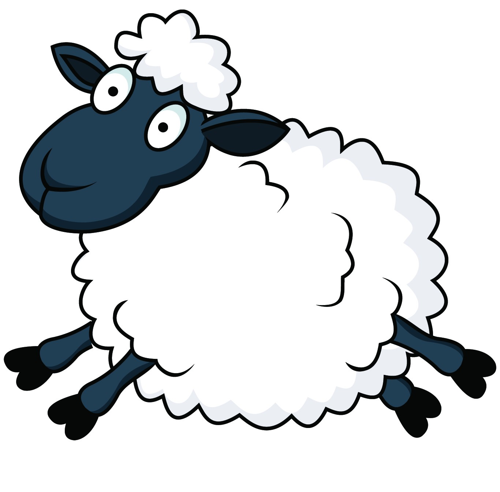
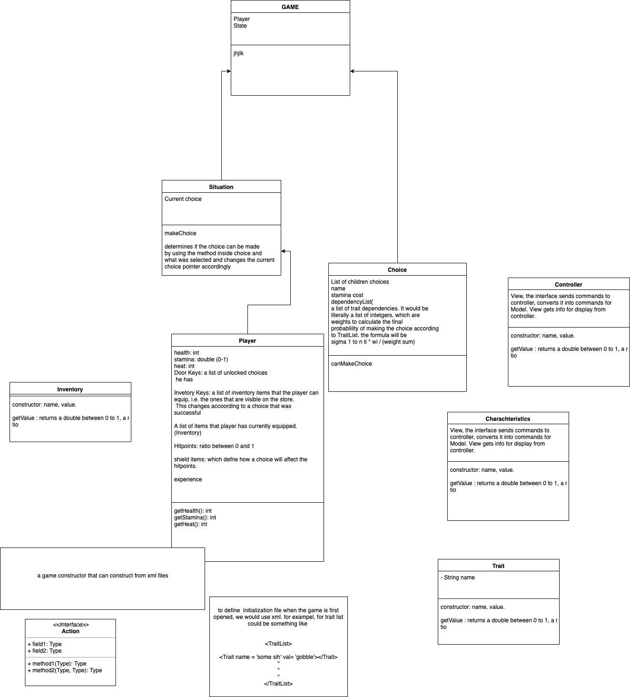

<p align="center">
  
  <br>
  <a href="https://github.com/kargq/StarsheepEngine"></a>
</p>

<p align="center">One small step for man, one giant leap for mankind.</p>

# StarsheepEngine
StarsheepEngine is a game engine for creating static decision-based games.
This engine is designed to be portable to any Java based OS.

# Running DevApp
```
./gradlew devApp
```

# Running DevTool
```
./gradlew rundev
```

# Notes

- Game object should be initialized with GameSoundManager, View, Controller all implemented
for the enviornment.

# Questions

- Do we need to worry about naming conflicts? As in maybe some other engine might have
a sound manager called GameSoundManager.

# UML


